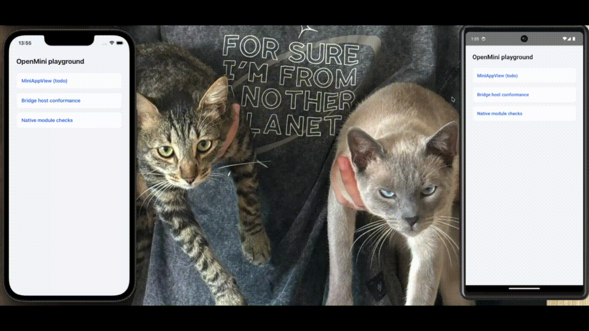
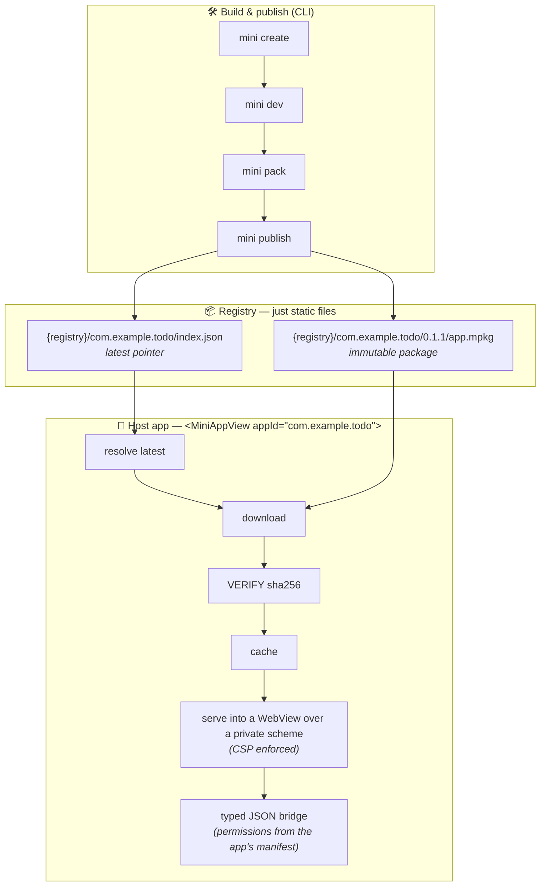

# OpenMini

<p>
  <a href="https://github.com/BoumouzounaBrahimVall/openmini/actions/workflows/ci.yml"></a>
  <a href="https://www.npmjs.com/package/@openmini/react-native"></a>
  <a href="LICENSE"></a>
  <a href="https://deepwiki.com/BoumouzounaBrahimVall/openmini"></a>
</p>

> **Portals, but open-source — and your registry is an S3 bucket.**

OpenMini is a self-hosted mini-app runtime for React Native. Ship plain-React
web apps into your native app **without app-store releases**: publish a
hash-verified package to any static file server, and hosts pick the new
version up on next launch.

<p align="center">
  
</p>

```tsx
import { MiniAppProvider, MiniAppView } from "@openmini/react-native";

<MiniAppProvider registryUrl="https://miniapps.yourcdn.com">
  <MiniAppView appId="com.example.todo" onClose={() => nav.goBack()} />
</MiniAppProvider>;
```

That's the whole integration. The mini-app is a plain React web app talking to
your host through a typed bridge (`mini.storage`, `mini.request`,
`mini.host.invoke(...)` for APIs **you** define).

## Why not the alternatives?

|                | Ionic Portals                    | FinClip                          | **OpenMini**                              |
| -------------- | -------------------------------- | -------------------------------- | ----------------------------------------- |
| Model          | Web mini-apps in native/RN hosts | WeChat-style mini-programs       | Web mini-apps in RN (later Flutter) hosts |
| License        | Commercial                       | Commercial, free tier            | **Apache-2.0**                            |
| Distribution   | Appflow (their cloud)            | Their cloud / on-prem enterprise | **Any static file server you own**        |
| Mini-app stack | Any web framework                | Proprietary DSL                  | Plain React/TS + typed bridge             |

## How it works



- **Registry = static files.** S3, GitHub Pages, nginx — anything that serves
  bytes. The protocol is [four files and three rules](specs/registry-protocol.md).
- **Packages are verified before they run.** sha256 checked against the
  registry index before extraction, then per-file hashes; a tampered package
  is refused with a typed error.
- **Capabilities are opt-in.** A mini-app's manifest declares `permissions`
  and `allowedDomains`; the bridge rejects everything else, and a build-time
  CSP blocks undeclared origins inside the WebView itself.
- **Host-defined APIs.** Expose your app's superpowers with schema-validated
  handlers (`defineHostApi`) — mini-apps call them as `mini.host.invoke(name, payload)`.

**Honest scope (v0.1)**: mini-apps are for **trusted** code — your teams,
your partners. Storage is namespaced per app and network is allow-listed, but
mini-apps share one WebView data store and packages are hash-verified, not
signature-verified. [SECURITY.md](SECURITY.md) spells out the exact trust
model with every claim traced to its test; isolation and signing are on the
[roadmap](ROADMAP.md) behind real demand.

## Get started

- **[Quickstart](docs/quickstart.md)** — zero to a running mini-app in under 15 minutes.
- **[Bridge API reference](docs/bridge-api.md)** — the `mini.*` surface.
- **[Limitations](docs/limitations.md)** — what the WebView architecture
  can't do (maps, camera preview…), and the patterns that cover most of it today.
- **Specs** — the protocol is the product:
  [bridge](specs/bridge-protocol.md) ·
  [manifest](specs/manifest.md) ·
  [package format](specs/package-format.md) ·
  [registry](specs/registry-protocol.md) ·
  [architecture](specs/architecture.md)

## Packages

| Package                                                                          | What it is                                                                                                       |
| -------------------------------------------------------------------------------- | ---------------------------------------------------------------------------------------------------------------- |
| [`@openmini/runtime`](https://www.npmjs.com/package/@openmini/runtime)           | Mini-app SDK: the typed `mini.*` bridge client (zero deps) · [docs](packages/runtime/README.md)                  |
| [`@openmini/cli`](https://www.npmjs.com/package/@openmini/cli)                   | `mini create / dev / build / pack / publish / inspect` · [docs](packages/cli/README.md)                          |
| [`@openmini/react-native`](https://www.npmjs.com/package/@openmini/react-native) | Host SDK: `<MiniAppProvider>` + `<MiniAppView>`, resolver, bridge host · [docs](packages/react-native/README.md) |
| [`conformance/`](conformance)                                                    | Golden bridge fixtures — any host implementation must pass them                                                  |

## Status

Pre-release. The v0.1.0 release criteria are demonstrated end to end (bare RN
and Expo hosts, iOS and Android, on-device conformance suite, tamper and OTA
tests) — see [ROADMAP.md](ROADMAP.md) for phases, locked decisions, and what
gets built only on real demand.

Works with React Native ≥ 0.76 (new architecture) and Expo SDK ≥ 54 via a
[config plugin](packages/react-native/README.md#install--expo-dev-builds--prebuild).

## License

Apache-2.0
